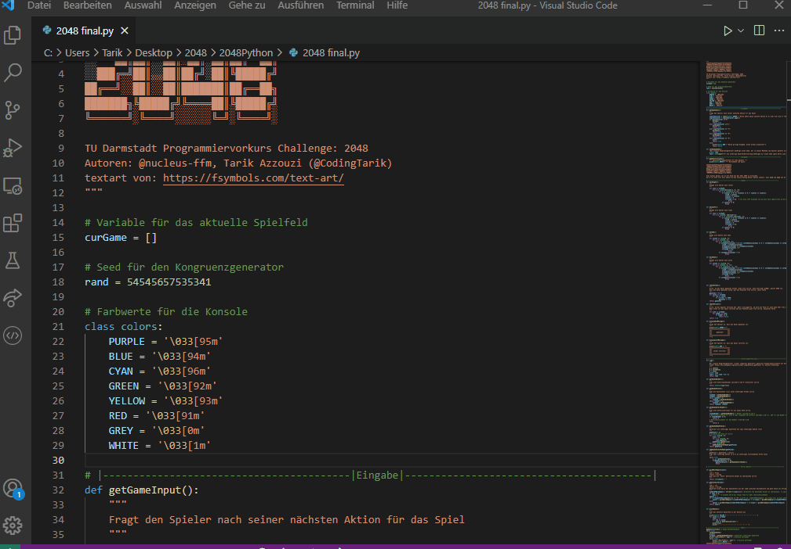

# 2048 Python
2048 implemented in Python

# 2048 Python🎮
This is a game made with knowledge of the Programmiervorkurs of TU Darmstadt.

## Preview


## Clone🔄
> We recommend VS Code

- Enter the following command to clone
  
  ```shell
  $ git clone https://github.com/CodingTarik/2048Python.git
  ```
## License📜

